# transmitter

<!-- pandoc -f markdown -t html5 README.md -s --embed-resources --standalone -c github-markdown.css -o README.html
 -->

Raspberry Pi Pico から微弱電波を送出するプログラムです。  
[Tinygo](https://tinygo.org)で、Raspberry Pi Pico のPWMを制御し、AMやFMラジオで受信できる微弱電波を生成します。
これで、音楽等を放送することが可能です。  
これは、以前、作成した[tinygo_tx](https://github.com/triring/tinygo_tx) を改良したものです。
[tinygo_tx](https://github.com/triring/tinygo_tx) では、電波を送出するPWMの制御部と音楽等を生成するコードが一体となっていて、拡張性がありませんでした。
そこで、電波を送出するPWMの制御部をドライバとして独立させ、パッケージにまとめて汎用性を高めました。  
10cm程度のジャンパー線があればOK、ハードの改造は不要です。  

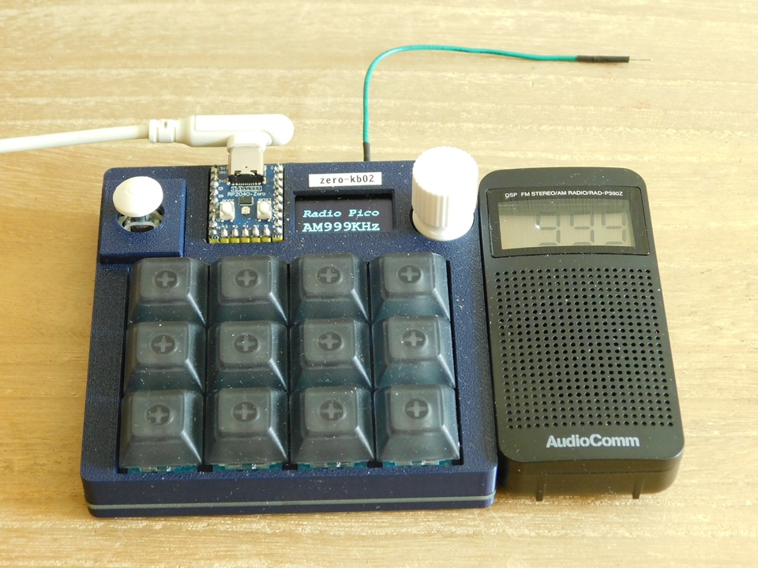

写真は、Raspberry Pi Pico と同じRP2040チップを搭載したマイコンボード[RP2040-Zero](https://www.waveshare.com/wiki/RP2040-Zero)で作られたマイクロパッド[zero-kb02](https://github.com/sago35/tinygo_keeb_workshop_2024/blob/main/buildguide.md)
です。機能的には互換品なのでデモ用として使用しました。

## DEMO

以下は、[tinygo_tx](https://github.com/triring/tinygo_tx) でRP2040で999KHzの電波を送信し、AMラジオで受信しているデモです。  
基本機能は、変わっていないので、再掲します。

[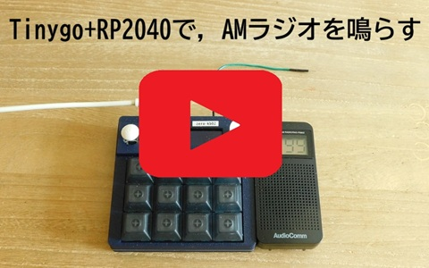](https://youtu.be/EvfH8MqYdDI)  

[RP2040RadioStation:Tinygo+RP2040で，AMラジオを鳴らす](https://youtu.be/EvfH8MqYdDI)

## Features

*transmitter* は、PWMで中波帯から超短波帯の微弱電波を生成し、送信します。  
ハードの改造は不要です。PWM出力が可能なGPIO端子に、数十センチ程度の導電線を接続するだけで、AM/FMラジオから音楽や効果音が流れます。  

## Requirement

### Software

* [Tinygo 開発環境](https://tinygo.org/getting-started/install/)

### Hardware

* Raspberry Pi Pico、または、RP2040を搭載した互換品のマイコンボード
* 数十センチ程度の導電線(ジャンパーケーブル等)
* 以下の周波数帯を受信可能なラジオ  
        - 中波放送(AMラジオ放送)のAM波(526.5～1606.5kHz)を受信できるもの  
        - 超短波放送(FMラジオ放送)のFM波(76.0～108.0MHz)を受信できるもの  

## Installation

*transmitter* は、tinygoに付属する標準ライブラリのpwm出力の制御機能しか使っていません。  
tinygoの開発環境がきちんと構築されていれば、特に用意するものはありません。  
まだ、tinygoをインストールしていない場合は、以下のガイドを読んで開発環境を構築してください。  

[Tinygo Quick install guide](https://tinygo.org/getting-started/install/)

以下のコマンドで、必要なファイル一式をローカルディレクトリにコピーして下さい。  

```bash
        git clone https://github.com/triring/transmitter
        cd transmitter
```
## Usage

最初に、事前にコンパイルしたバイナリーでラジオを鳴らす方法を解説します。  

1. Raspberry Pi Picoの20Pin(GPIO15)に、長さ数十センチ程度のジャンパーケーブルを接続してください。

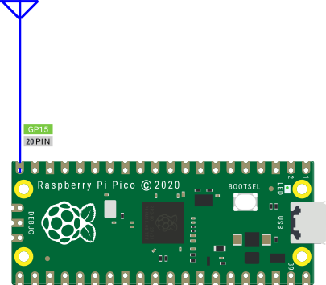

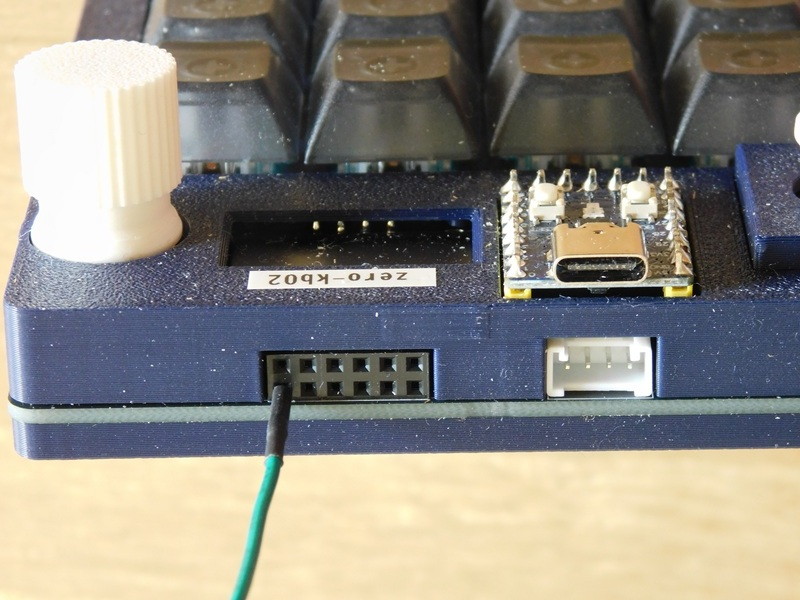

写真はRP2040チップを搭載したマイコンボード[RP2040-Zero](https://www.waveshare.com/wiki/RP2040-Zero)で作られたマイクロパッド[zero-kb02](https://github.com/sago35/tinygo_keeb_workshop_2024/blob/main/buildguide.md)の拡張ポートのGPIO15に差し込まれたアンテナ用のジャンパーワイヤー  

2. demoディレクトリ内にある 任意のuf2ファイルをRaspberry Pi Picoに書き込んで下さい。  

* [RadioPicoAM.uf2](demo/RadioPicoAM/RadioPicoAM.uf2) は、AMラジオ用です。AM 999KHzで電波を送出します。  
* [RadioPicoFM.uf2](demo/RadioPicoAM/RadioPicoFM.uf2) は、FMラジオ用です。FM 79.9, 89.9, 100.1 MHzで電波を送出します。

```bash
        > tree -a -f demo/
        demo
        +---demo/RadioPicoAM
        │       +--- demo/RadioPicoAM/RadioPicoAM.uf2
        │       +--- demo/RadioPicoAM/main.go
        +---demo/RadioPicoFM
                +--- demo/RadioPicoFM/RadioPicoFM.uf2
                +--- demo/RadioPicoFM/main.go

```

3. ラジオの電源を入れ、書き込んだuf2ファイル名の周波数に合わせてください。    
ラジオから、音楽が聞こえるはずです。  

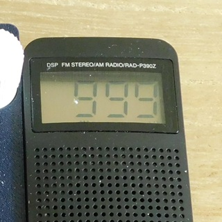  

## Compile

今回のプログラムは、Raspberry Pi Picoの20Pin(GPIO15)をアンテナ出力に設定することを前提として、AM帯やFM帯の周波数を生成する設定になっています。  
これ以外のGPIOや他の周波数を使用する場合は、設定を書き換える必要があります。  
examplesディレクトリにサンプルプログラムがあります。
その中のそれぞれのディレクトリにあるmain.goファイルを開いて、設定を書き換えて下さい。

```bash
$ tree -a -f examples/
examples
+--- examples/NeeNaw	// 海外の緊急車両のサイレン音
|    +--- examples/NeeNaw/main.go
|
+--- examples/Simple	// 中央ラ音  440Hz
     +--- examples/Simple/main.go
```

<!--
$ tree -a -f examples/
examples
+--- examples/EffectTest
|    +--- examples/EffectTest/main.go
|
+--- examples/NeeNaw	// 海外の緊急車両のサイレン音
|    +--- examples/NeeNaw/main.go
|
+--- examples/Simple	// 中央ラ音  440Hz
|    +--- examples/Simple/main.go
|
+--- examples/effect
|    +--- examples/effect/main.go
|
+--- examples/jukebox
|    +--- examples/jukebox/main.go
|
+--- examples/songs
    +--- examples/songs/main.go
-->
### 書き換えるファイルと変更するパラメータ   

設定を変更するmain.goファイルを開き、GPIOや周波数の設定を変更して下さい。  

#### GPIO端子の設定

1. 変更場所  
デバイスの初期化を行っているfunc main()の先頭部分のinitTransmitter()メソッドを探して下さい。  

```go
	// 出力アンテナに設定するGPIOピンに対応するpwmのチャンネルを取得する。
	pwm := pinToPWM[machine.GPIO15]
	// 微弱電波を出力するGPIOピンを指定して、送信機を設定する。
	tx, err := initTransmitter(pwm, machine.GPIO15)
	if err != nil {
		fmt.Printf("failed to configure PWM\r\n")
		return
	}
```

2. 変更内容  

initTransmitter()は、引数として、アンテナ出力に設定するPinと、そのPinに割り当てられているpwnのチャンネル番号が必要です。  
Raspberry Pi Picoのpwnのチャンネルは、以下の表のように割り当てられています。  

| GPIO  | 0  | 1  | 2  | 3  | 4  | 5  | 6  | 7  | 8  | 9  | 10 | 11 | 12 | 13 | 14 | 15 |
| :---- | -: | -: | -: | -: | -: | -: | -: | -: | -: | -: | -: | -: | -: | -: | -: | -: |
| PWM Ch| 0A | 0B | 1A | 1B | 2A | 2B | 3A | 3B | 4A | 4B | 5A | 5B | 6A | 6B | 7A | 7B |

| GPIO  | 16 | 17 | 18 | 19 | 20 | 21 | 22 | 23 | 24 | 25 | 26 | 27 | 28 | 29 |    |    |
| :---- | -: | -: | -: | -: | -: | -: | -: | -: | -: | -: | -: | -: | -: | -: | -: | -: |
| PWM Ch| 0A | 0B | 1A | 1B | 2A | 2B | 3A | 3B | 4A | 4B | 5A | 5B | 6A | 6B |    |    |

この対応については、Raspberry Pi Pico用に事前に定義してあるので、
Raspberry Pi Picoを使用するのであれば、以下のコードで、割り当てられているpwnのチャンネル番号を取得することができます。  
```go
	pwm := pinToPWM[machine.GPIO15]
```
Raspberry Pi Pico以外のマイコンを使用するのであれば、マニュアル等を参照して、アンテナ出力に設定するPINに合わせて、使用するGPIOとそれ対応するPWM チャンネルに書き換えて下さい。  

#### 出力周波数の設定

1. 変更場所  
func main()の先頭部分の搬送波の周波数を設定している tx.SetFrequency() メソッドを探して下さい。  

```go
// 搬送波として使用する周波数の設定
	tx.SetFrequency(999000)
```

この定義の前に定義されている周波数を選んで、書き換えて下さい。
設定する単位は、Hzです。
999KHzに設定する場合は、999000と書き込んで下さい。
なお、AM帯とFM帯で設定方法が少し異なるので、2と3で説明します。

2. FM帯の設定

最初に、pwmでFM放送の周波数帯の電波を、生成しようとしましたが、pwmで出力できる周波数が低く、直接、出力することはできませんでした。  
そこで、出力する周波数の整数倍の高次に発生する高調波（こうちょうは）がFM帯に入る周波数を探しました。  
以下の図は、そのソフトで1.0, 2.0, 4.0, 5.0, 10.0 MHzを出力した時のFM帯の高調波を測定した結果です。

<a href="images/FM_01_0MHz.csv.png">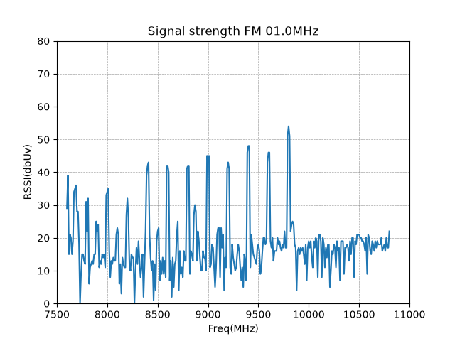</a>
<a href="images/FM_02_0MHz.csv.png">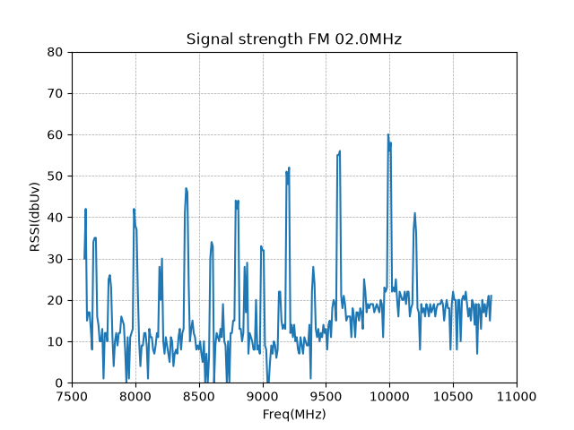</a>
<a href="images/FM_04_0MHz.csv.png">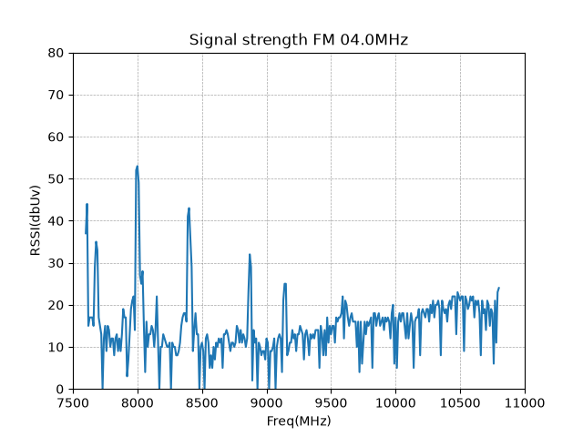</a>
<a href="images/FM_05_0MHz.csv.png">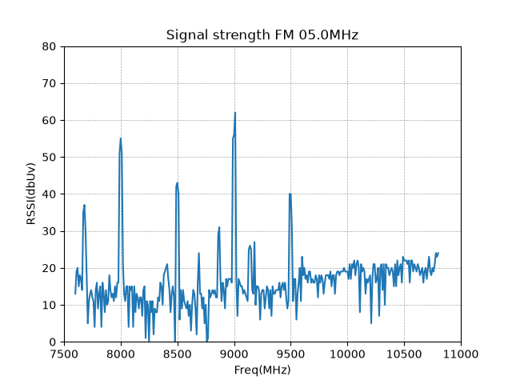</a>
<a href="images/FM_10_0MHz.csv.png">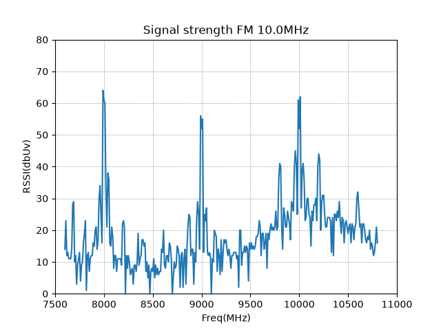</a>

これらの図から、高調波のピークを拾って、まとめたものが以下の表です。
電波の強い地元のFM局の76.8, 88.7, 91.4MHzは、除外しています。
このように、設定周波数により、数個から十数個の高調波が出力されます。
目的に応じて、FM波用の周波数を設定して下さい。

**FM波設定表**  

| FM波の定義   | 設定値   | 出力周波数(MHz) | 高調波 1 | 高調波 2 | 高調波 3 | 高調波 4 | 高調波 5 | 高調波 6 | 高調波 7 | 高調波 8 | 高調波 9 | 高調波10 | 高調波11 | 高調波12 |
|:------------:| --------:| ---------------:| --------:| --------:| --------:| --------:| --------:| --------:| --------:| --------:| --------:| --------:| --------:| --------:|
| FREQ_1MHz    |  1000000 |  1.00MHz        |  76.1    |  78.1    |  80.1    |  82.0    |  84.1    |  86.0    |  88.0    |  89.9    |  92.0    |  94.0    |  96.0    |  98.0    |
| FREQ_2MHz    |  2000000 |  2.00MHz        |  76.1    |  79.9    |  84.0    |  88.0    |  92.0    |  95.9    | 100.1    |          |          |          |          |          |
| FREQ_4MHz    |  4000000 |  4.00MHz        |  76.1    |  80.0    |  84.0    |          |          |          |          |          |          |          |          |          |
| FREQ_5MHz    |  5000000 |  5.00MHz        |  80.0    |  85.0    |  90.1    |  94.9    |          |          |          |          |          |          |          |          |
| FREQ_10MHz   | 10000000 | 10.00MHz        |  79.9    |  89.9    | 100.1    |          |          |          |          |          |          | 

3. AM帯の設定

AM放送の周波数帯では、それぞれの放送局に割り当てられる周波数は、9kHz間隔で割り振られています。  
最近の市販ラジオは、電波の周波数を選局、電波から音声を取り出す検波、復調といった一連の受信処理を全てデジタルで行うDSPラジオが主流です。  
正確な周波数で送信しないとDSPラジオは受信してくれません。  

そこで、この条件に適合する周波数を生成できるPWMの設定を調べたところ、誤差が少なかったのは以下の表に示す周波数でした。  
必要に応じて、これらの周波数の中から適切なものを選び、period に設定してから、コンパイルして下さい。  
なお、同調回路がコイルとバリコンで構成された昔ながらのアナログラジオであれば、周波数の設定に気を使う必要はありません。  

**AM波設定表**  

| AM波の定義 | 設定値  |
| ---------- | -------:|
| AM0612KHz  |  612000 |
| AM0684KHz  |  684000 |
| AM0693KHz  |  693000 |
| AM0738KHz  |  738000 |
| AM0774KHz  |  774000 |
| AM0819KHz  |  819000 |
| AM0999KHz  |  999000 |
| AM1224KHz  | 1224000 |
| AM1269KHz  | 1269000 |
| AM1287KHz  | 1287000 |
| AM1368KHz  | 1368000 |
| AM1548KHz  | 1548000 |


### コンパイル  

今回は、examples/Simpleディレクトリのコードを例として説明します。  
以下のコマンドで、プログラムをコンパイルして下さい。

```bash
        > tinygo build -target=pico -size=short -o Simple.uf2 .
        code    data     bss |   flash     ram
        17604     856    5576 |   18460    6432
```

### 実行  

コンパイルが完了すると、作業しているディレクトリ内にSimple.uf2 というファイルが作られます。これを、Raspberry Pi Pico に書き込んで下さい。  
ラジオを設定した周波数にチューニングして、アンテナ線の近くに置いて下さい。  
音楽が聞こえてきたら成功です。  

### 注意事項  

----
> もし、使用する出力周波数が**地元放送局の周波数と被る**ようであれば、必ず**修正してから使用**して下さい。  
----

## 新しい楽曲の作り方  

music や effect のディレクトリ内のgoファイルを参考にして下さい。
曲データ作成に必要なパラメータは、以下の2つのファイルに書かれています。  

### 曲データの共通構造体
曲データの共通構造体は、ファイル[music/song.go](music/song.go)に定義してあります。

```go
package music

// 曲データの共通構造体

type Note struct {
	Tone     float64
	Duration float64
}

type Song struct {
    Title       string
    BPM         float64
    Repetitions int
    Notes       []Note
}
```
### 音階、音長

音階、音長は、ファイル[music/note.go](music/note.go)
に定義してあります。

```go
// 音長の定義
// Note Dulation
const (
	L1d   = 6.000000 // 付点音符
	L1    = 4.000000
	L2d   = 3.000000 // 付点音符
	L2    = 2.000000
	L4d   = 1.500000 // 付点音符
	L4    = 1.000000
	L8d   = 0.750000 // 付点音符
	L8    = 0.500000
	L16d  = 0.375000 // 付点音符
	L16   = 0.250000
	L32d  = 0.187500 // 付点音符
	L32   = 0.125000
	L64d  = 0.093750 // 付点音符
	L64   = 0.062500
	L128d = 0.046875 // 付点音符
	L128  = 0.031250
)

// 音階の定義
// 平均律 音階表
// Equal temperament Scale chart
const (
	R   = 0.00000000  // 休符
	C0  = 16.35159783 // Do
	CS0 = 17.32391444 // Do#
	D0  = 18.35404799 // Re
	DS0 = 19.44543648 // Re#
	E0  = 20.60172231 // Mi
	F0  = 21.82676446 // Fa
	FS0 = 23.12465142 // Fa#
	G0  = 24.49971475 // So
	GS0 = 25.95654360 // So#
	A0  = 27.50000000 // Ra
	AS0 = 29.13523509 // Ra#
	B0  = 30.86770633 // Si
	// 以下略
}
```

## 追記事項

ラジオを持っていない方は、このソフトは使えませんよね。  
でも、良い方法があります。  
日頃から、「君のような勘のいいガキは嫌いだよ。」と言われているような方々はお気づきかも知れませんが、下図のように、圧電スピーカー(圧電サウンダー)をGPIO15とGNDに接続すると、音が鳴ります。  
手元に圧電スピーカーがある方は、ぜひ試して見てください。  

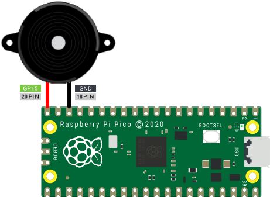  

## warning

**- 警告 -**

このシステムで、以下のような事をしてはいけません。

* 送信出力を上げる。
* 大きなアンテナに接続する。

3mの距離における電界強度が、500μV/mを上回ると電波法違反になります。
あくまでも、「マイコンボードの近くにラジオを置いたら、ノイズが聞こえた。」くらいの範囲で運用して下さい。

## Author

* @triring

## License

### 基本ライセンス  

*transmitter* is under [MIT license](https://en.wikipedia.org/wiki/MIT_License).

### 追加ライセンス

[Poul-Henning Kamp](https://people.freebsd.org/%7Ephk/) 氏が提唱しているBEER-WAREライセンスを踏襲し配布する。  

### "THE BEER-WARE LICENSE" (Revision 42)

<akio@triring.net> wrote this file. As long as you retain this notice you
can do whatever you want with this stuff. If we meet some day, and you think this stuff is worth it, you can buy me a beer in return.
Copyright (c) 2024 Akio MIWA @triring  

### "THE BEER-WARE LICENSE" (第42版)

このファイルは、<akio@triring.net> が書きました。あなたがこの条文を載せている限り、あなたはソフトウェアをどのようにでも扱うことができます。
もし、いつか私達が出会った時、あなたがこのソフトに価値があると感じたなら、見返りとして私にビールを奢ることができます。  
Copyright (c) 2024 Akio MIWA @triring  
